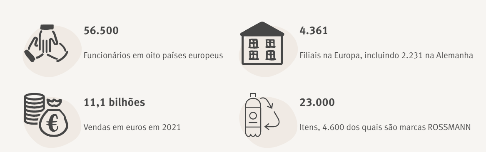

# PREVISÃO DE VENDAS - ROSSMANN DROGERIEMARKT

## 💻 Problema de negócio

   Prever a receita é uma atividade essencial para o planejamento financeiro de qualquer negócio. No contexto da rede de drogarias, a previsão de vendas para as próximas 6 semanas é crucial para que o CFO possa determinar os valores a serem investidos em reformas em cada loja. 
   No momento atual, as previsões são realizadas de forma manual pelos gerentes de cada loja, o que pode levar a uma grande variação nos resultados em consequência da influência de fatores distintos, como promoções, competições por clientes, feriados e sazonalidade. 
   Para lidar com essa questão, propomos um projeto que utiliza técnicas de Data Science para prever as vendas de cada loja de forma automática e mais precisa. Com isso, o CFO terá informações mais confiáveis e consistentes para determinar o investimento em cada loja, melhorando assim a estrutura e o atendimento ao público. 
   Além disso, o projeto permitirá que o CFO acesse as previsões através de um Bot do aplicativo Telegram, o que proporcionará maior agilidade e praticidade na consulta das informações. Essa iniciativa trará benefícios tanto para a empresa quanto para os clientes, pois permitirá aprimorar a experiência do consumidor e aumentar a eficiência financeira da rede de drogarias.

### Premissas
    
   Para a construção da solução de previsão de vendas, foram definidas as seguintes premissas:

    1. Disponibilidade: A previsão de vendas estará acessível via aplicativo do Telegram e será disponibilizada para consulta a qualquer momento.

    2. Seleção das lojas: A previsão de vendas será realizada apenas para as lojas que tiveram vendas registradas na base de dados.

    3. Descarte dos dias em que as lojas estiveram fechadas: Para a realização da previsão de vendas, foram descartados os dias em que as lojas estiveram fechadas.
    

## Descrição dos dados

 Variável | Descrição
:------------|:---------
Store | ID exclusivo para cada loja
Sales | O volume de vendas de um determinado dia (variável que será prevista)
Customers | Número de clientes em um determinado dia
Open | Indicador para funcionamento da loja, aberta: 0 = fechada e 1 = aberta
StateHoliday | Feriado estadual. Normalmente todas as lojas, com poucas exceções, estão fechadas nos feriados estaduais. Todas as escolas estão fechadas nos feriados e fins de semana. a = public holiday, b = Easter holiday, c = Christmas, 0 = None
SchoolHoliday | Indica se store e date foram afetadas pelo fechamento de escolas públicas
StoreType | Diferencia entre os 4 modelos de loja diferentes (a, b, c, d)
Assortment | Descreve um nível de sortimento (a = basic, b = extra, c = extended)
Competition_distance | Distância em metros até a loja concorrente mais próxima
Competition_open_since (_month/_year) | Fornece o ano e o mês aproximados da hora em que o concorrente mais próximo foi aberto
Promo | Indica se uma loja está realizando uma promoção naquele dia (0 = store is not participating, 1 = store is participating)
Promo2 | Promo2 é uma promoção contínua e consecutiva para algumas lojas (0 = store is not participating, 1 = store is participating)
Promo2_since(_year/_week) | Descreve o ano e a semana do calendário em que a loja começou a participar da promo2
Promo_interval | Descreve os intervalos consecutivos em que a Promo2 é iniciada, nomeando os meses em que a promoção é iniciada novamente. E.g: "Feb,May,Aug,Nov" significa que cada rodada começa em February, May, August, November de qualquer ano para essa loja.

## Estratégia de solução

**Passo a passo:**

1. Definição do problema: compreender o contexto do negócio e os objetivos do projeto.

2. Coletar e limpar os dados: coletar os dados e executar as etapas de limpeza e pré-processamento de dados. Incluindo: tratamento de valores ausentes, valores discrepantes e a transformação dos dados para torná-los utilizáveis para análise.

3. Explorar os dados: realizar análise exploratória de dados (EDA) para entender as características dos dados, identificar padrões e tendências e gerar hipóteses para análise posterior.

4. Feature engineering: selecionar e extrair features relevantes dos dados e criar novas features que possam melhorar o desempenho preditivo do modelo.

5. Construção de modelo: selecionar um modelo apropriado com base no problema e nos dados. Treinar e avaliar o modelo usando métricas de desempenho apropriadas.

6. Otimizar e interpretar: otimizar o modelo para melhorar seu desempenho. Interpretar os resultados do modelo e extrair insights deles.

7. Implantação: Implantar o modelo em um ambiente de produção e monitorar seu desempenho.

8. Comunicação e documentação: Comunicar os resultados do projeto aos stakeholders relevantes e documentar o processo e os resultados para referência futura.

## Top 3 Data Insights

## Machine Learning Model Applied

## Resultados de Negócios

## Lessons Learned

## Next Steps

##  👩🏻‍💻 Autora
