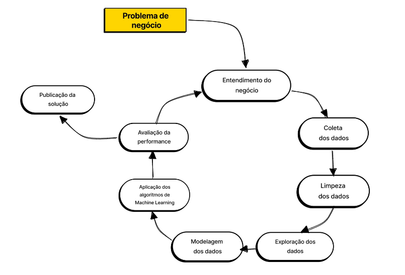
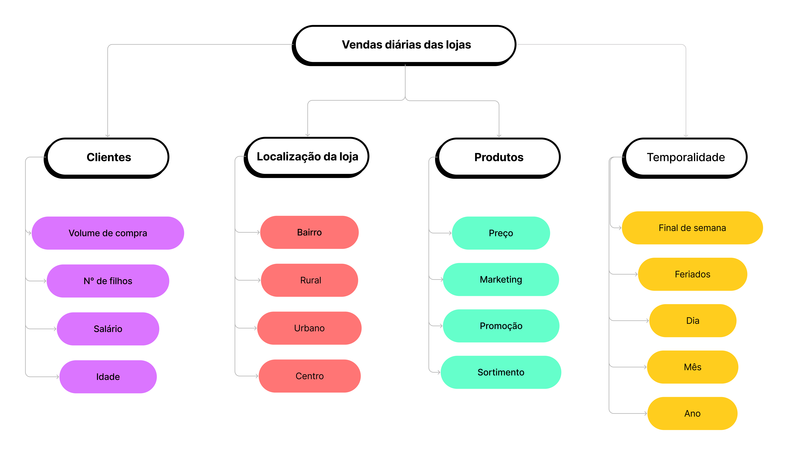
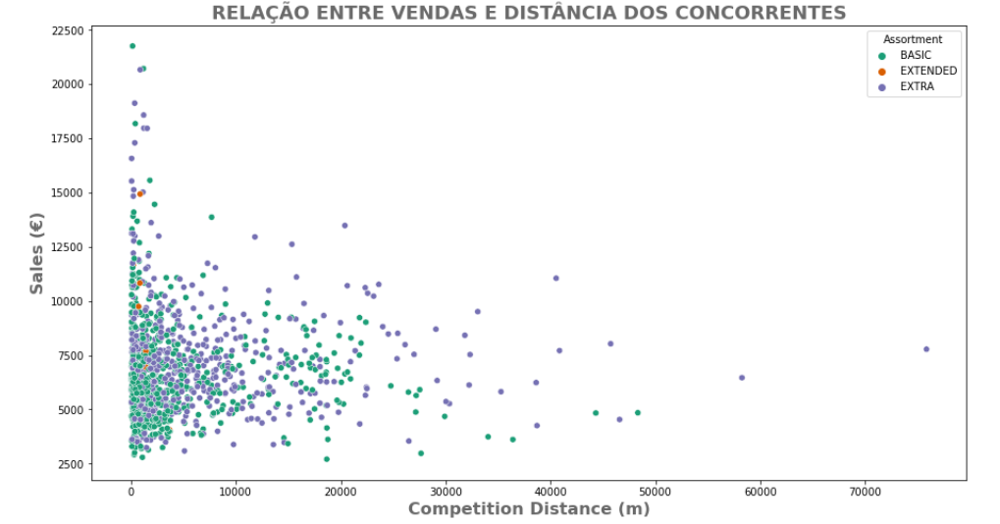
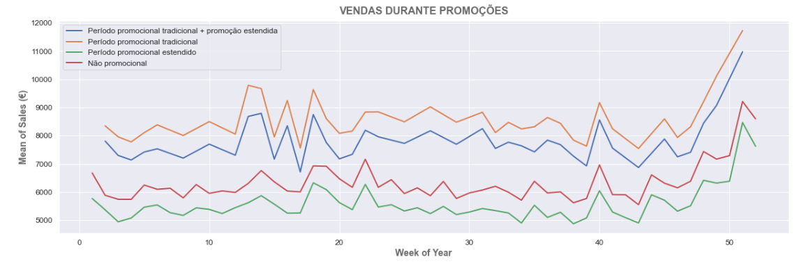
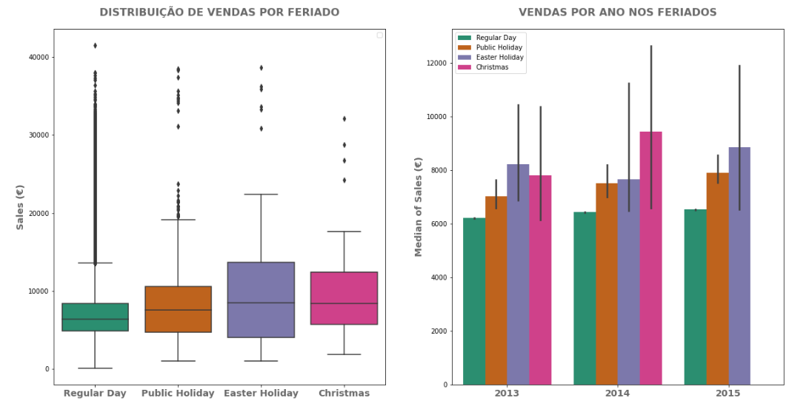
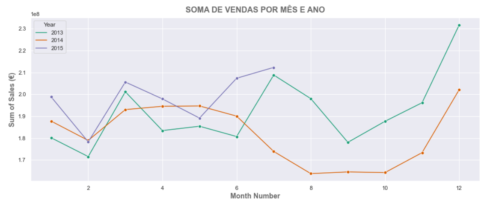
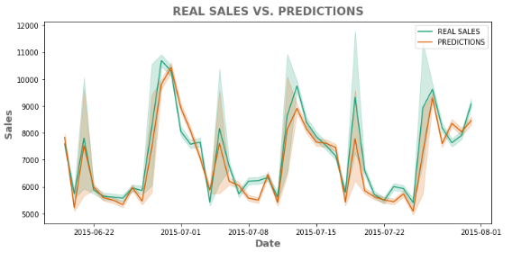
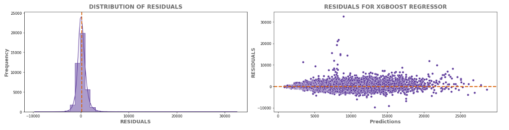

***
# PREVISÃO DE VENDAS - ROSSMANN DROGERIEMARKT
***

## A Rossmann Drogeriemarkt
***

A Rossmann Drogeriemarkt é uma rede de farmácias e drogarias alemã, fundada em 1972 por Dirk Roßmann. Atualmente, é uma das maiores redes de drogarias da Europa, com mais de 4.500 lojas em 8 países. A empresa oferece uma ampla variedade de produtos, incluindo medicamentos, produtos de higiene pessoal, beleza, bem-estar e alimentos saudáveis.

## 1. O problema de negócio
***

A Rossmann Drogeriemarkt valoriza a comodidade e satisfação dos clientes. Com esse objetivo, a empresa está sempre em busca de oferecer estruturas mais completas. Investindo em melhorias que tornem a experiência de compra ainda mais agradável, como vagas de estacionamento, sistemas de ar condicionado e banheiros para clientes. Neste contexto, a previsão de vendas para as próximas seis semanas é fundamental para que o CFO possa determinar os valores a serem investidos em reformas para cada loja da rede.

Atualmente, as previsões são realizadas utilizando a média. Embora seja uma abordagem simples, apresenta algumas limitações. Em primeiro lugar, a média não leva em consideração as variações ou tendências sazonais das vendas. Por exemplo, as vendas podem ser maiores em um determinado dia da semana ou mês do ano. Além disso, a média pode não levar em conta outros fatores que podem afetar as vendas, como eventos externos ou mudanças nas preferências dos consumidores. Por outro lado, as técnicas de machine learning podem ajudar a modelar e prever as vendas com base em múltiplos fatores, incluindo tendências sazonais, dados demográficos, preços, promoções, entre outros. Isso pode levar a previsões mais precisas e aperfeiçoar as estratégias de negócios.

Para enfrentar essa questão, apresentamos um projeto que utiliza técnicas de Data Science para prever as vendas de cada loja de forma automática e mais precisa. Com isso, o CFO terá informações mais confiáveis e consistentes para determinar o investimento em cada loja, melhorando assim a estrutura e o atendimento ao público, mantendo a posição de destaque da Rossmann no mercado de drogarias na Alemanha.

### 1. 2 Premissas
***
    
Foram estabelecidas as seguintes premissas para a construção da solução de previsão de vendas:

1. A disponibilidade da previsão de vendas será via aplicativo do Telegram, permitindo sua consulta a qualquer momento.

2. A previsão de vendas será feita exclusivamente para as lojas que tiveram vendas registradas na base de dados.

3. Para a realização da previsão de vendas, serão excluídos os dias em que as lojas estiveram fechadas.

## 2. Descrição dos dados
***

Os dados utilizados neste projeto foram coletados a partir da plataforma Kaggle e englobam informações históricas de vendas em 1.115 lojas da rede Rossmann. As descrições iniciais dos atributos presentes nos dados estão listadas abaixo:

 Variável | Descrição
:------------:|:---------:
Store | ID exclusivo para cada loja
Sales | O volume de vendas de um determinado dia (variável que será prevista)
Customers | Número de clientes em um determinado dia
Open | Indicador para funcionamento da loja, aberta: 0 = fechada e 1 = aberta
StateHoliday | Feriado estadual. Normalmente todas as lojas, com poucas exceções, estão fechadas nos feriados estaduais. Todas as escolas estão fechadas nos feriados e fins de semana. a = public holiday, b = Easter holiday, c = Christmas, 0 = None
SchoolHoliday | Indica se store e date foram afetadas pelo fechamento de escolas públicas
StoreType | Diferencia entre os 4 modelos de loja diferentes (a, b, c, d)
Assortment | Descreve um nível de sortimento (a = basic, b = extra, c = extended)
Competition_distance | Distância em metros até a loja concorrente mais próxima
Competition_open_since (_month/_year) | Fornece o ano e o mês aproximados da hora em que o concorrente mais próximo foi aberto
Promo | Indica se uma loja está realizando uma promoção naquele dia (0 = store is not participating, 1 = store is participating)
Promo2 | Promo2 é uma promoção contínua e consecutiva para algumas lojas (0 = store is not participating, 1 = store is participating)
Promo2_since(_year/_week) | Descreve o ano e a semana do calendário em que a loja começou a participar da promo2
Promo_interval | Descreve os intervalos consecutivos em que a Promo2 é iniciada, nomeando os meses em que a promoção é iniciada novamente. E.g: "Feb,May,Aug,Nov" significa que cada rodada começa em February, May, August, November de qualquer ano para essa loja.

## 3. Estratégia de solução
***

**Passo a passo:**

1. Definição do problema: compreender o contexto do negócio e os objetivos do projeto.

2. Coletar e limpar os dados: coletar os dados e executar as etapas de limpeza e pré-processamento de dados. Incluindo: tratamento de valores ausentes, valores discrepantes e a transformação dos dados para torná-los utilizáveis para análise.

3. Explorar os dados: realizar análise exploratória de dados (EDA) para entender as características dos dados, identificar padrões e tendências e gerar hipóteses para análise posterior.

4. Feature engineering: selecionar e extrair features relevantes dos dados e criar novas features que possam melhorar o desempenho preditivo do modelo.

5. Construção de modelo: selecionar um modelo apropriado com base no problema e nos dados. Treinar e avaliar o modelo usando as métricas: MAE, MAPE, RMSE.

6. Otimizar e interpretar: otimizar o modelo para melhorar seu desempenho. Interpretar os resultados do modelo e extrair insights deles.

7. Implantação: Implantar o modelo em um ambiente de produção e monitorar seu desempenho.

8. Comunicação e documentação: Comunicar os resultados do projeto aos stakeholders relevantes e documentar o processo e os resultados para referência futura.

## 4. Ferramentas utilizadas
***

- Python
- Bibliotecas Python: pandas, Matplotlib, Seaborn, Numpy, sidetable e Sklearn
- Jupyter Notebook e VSCode
- Git e Github

## 5. Técnicas utilizadas
***

- Análise Exploratória de Dados (EDA)
- Seleção de recursos com a utilização do Boruta
- Algoritmos de Regressão: foram testados diferentes algoritmos de regressão, incluindo Linear Regression, Lasso Regression, Random Forest e XGBoost.
- Validação Cruzada e Otimização de Hiperparâmetros
- Métricas de Desempenho: para avaliar o desempenho dos modelos, utilizamos RMSE, MAE e MAPE.

## 6. Principais insights
***

Um conjunto de fatores pode afetar o desempenho das vendas nas lojas físicas de uma rede de drogarias. Para definir o objetivo da análise e identificar as variáveis relevantes, foi criado um mapa mental que trouxe clareza à estrutura da análise e permitiu a identificação de padrões e tendências.

### A proximidade com uma loja concorrente não afeta negativamente as vendas
***

Ao considerarmos a presença de concorrentes próximos, é comum esperar uma redução nas vendas e no número de clientes, pois os consumidores têm mais opções de escolha e podem optar por comprar em lojas concorrentes mais próximas. No entanto, a análise de dados sugere que a distância das lojas concorrentes não tem influência na média de vendas. Outros fatores, como localização, preço e promoções, podem ter uma influência maior sobre as vendas.

É possível considerar hipóteses alternativas que explicam esse resultado, como preços mais competitivos oferecidos pela rede Rossmann em relação aos seus concorrentes. Além disso, a loja pode oferecer produtos ou serviços que se destacam dos concorrentes próximos, atraindo clientes mesmo que haja lojas concorrentes nas proximidades.

A fidelização de clientes também pode ser um fator importante, onde a loja pode ter uma base de clientes fiéis que preferem comprar naquela loja, independentemente da distância ou de outras opções de concorrentes próximos. Por fim, a localização privilegiada da loja pode compensar a proximidade dos concorrentes, atraindo um fluxo maior de clientes.

Esses fatores, combinados ou isolados, podem explicar por que a presença de concorrentes próximos não afeta as vendas e o número de clientes da rede Rossmann. Isso sugere que, ao invés de se preocupar com a presença de concorrentes próximos, as empresas podem se concentrar em oferecer preços competitivos, produtos e serviços diferenciados, fidelizar seus clientes e encontrar localizações privilegiadas para suas lojas.

###  Lojas com promoções extendidas não vendem mais
***

Ao analisarmos as vendas médias ao longo das semanas do ano, é possível observar que os períodos de promoção tradicional têm as maiores médias de vendas em todas as semanas do ano, seguidos pelo período de promoção tradicional com promoção estendida. Curiosamente, quando o período de promoção é somente o estendido é que se observa a menor média de vendas.

Existem algumas possíveis hipóteses que podem explicar esses resultados. Uma delas é que a promoção tradicional pode estar mais enraizada na cultura do consumidor e portanto, os clientes estão mais inclinados a comprar durante esse período. Além disso, a promoção estendida pode levar à diminuição da importância da promoção, tornando-a menos atraente para os clientes.

A tendência de aumento nas médias de vendas nas últimas semanas do ano para o período promocional tradicional + promoção extendida e o período promocional tradicional pode estar relacionada com o fato de que muitas pessoas deixam as compras de presentes para a última hora, buscando aproveitar as promoções de última hora. Por fim, a queda nas médias de vendas observada nas últimas semanas e nas primeiras semanas do ano, tanto para o período não promocional quanto para o período promocional estendido, pode estar relacionada à redução do poder de compra do consumidor após o período de gastos durante as festas de fim de ano.

É importante notar que, apesar das promoções parecerem ter um efeito positivo nas vendas, o gráfico de linhas mostra que as quedas nas médias de vendas são coincidentes, independentemente da presença de promoções nas lojas. Isso pode indicar outras variáveis, além da promoção, que afetam o comportamento do consumidor nas últimas semanas do ano.

### As vendas durante o Natal não são maiores em comparação a outros feriados
***

Utilizando o gráfico de boxplot para analisar as medianas das vendas para cada tipo de feriado em cada ano (2013, 2014 e 2015), podemos concluir que as vendas durante o período de Natal não apresentam diferenças significativas em relação a outros feriados. Observamos que a mediana das vendas durante o Natal é semelhante à mediana das vendas em outros feriados, como dias regulares e feriados públicos.

No entanto, o feriado de Easter Holiday (Páscoa) apresentou uma caixa mais ampla em termos de distribuição dos dados, o que sugere que houve uma maior variabilidade nas vendas nesse período. Ao analisar as medianas de vendas para cada tipo de feriado em cada ano, constatamos que em 2013 a mediana de vendas durante o feriado de Páscoa superou a do Natal. Em contrapartida, em 2014 as vendas no período de Natal foram superiores a todos os outros tipos de feriado.

Existem algumas hipóteses que podem explicar esses resultados. Primeiramente, é possível que o Natal não seja um feriado que estimule a compra de produtos em drogarias, mesmo que seja um momento importante para as famílias se reunirem e trocarem presentes. Além disso, o feriado de Páscoa pode estar associado a um maior consumo de produtos específicos, como chocolates e presentes relacionados à Páscoa, o que pode levar a uma maior variabilidade nas vendas nesse período.

Por fim, é válido destacar que as variações nas vendas entre diferentes feriados e anos podem ser influenciadas por fatores externos, como mudanças na economia ou no comportamento dos consumidores.

*Os dados das vendas durante o período de Natal de 2015 não estão disponíveis na base de dados*

### Padrões sazonais nas vendas ao longo de três anos e possíveis fatores influenciadores
***

Ao analisar o gráfico de linhas referente às vendas nos anos de 2013, 2014 e 2015, é possível identificar padrões de comportamento sazonal das vendas. Em 2013, houve picos de vendas em março, julho e dezembro, com dezembro apresentando as maiores vendas. Já em 2014, houve um platô nas vendas de março a junho, seguido por uma queda até novembro, com dezembro registrando o pico de vendas. Embora os dados de 2015 não estejam completos, os primeiros sete meses do ano mostraram um comportamento semelhante ao do ano anterior, com picos de vendas em março e julho, e vendas mais baixas em fevereiro e maio.

Com base nesses padrões, é possível formular hipóteses sobre os fatores que influenciam as vendas. Uma hipótese é que a sazonalidade pode ter influenciado nas vendas, com certos meses sendo mais propícios para as compras do que outros. Outra hipótese é que campanhas promocionais podem ter afetado as vendas, especialmente em períodos de pico, como dezembro. Além disso, a situação econômica do país pode ter afetado as vendas em determinados períodos, como a queda nas vendas registrada em 2014, que pode ter sido influenciada pela crise econômica que o país enfrentou na época.

## 7. Modelos de Machine Learning
***

Neste projeto, uma etapa fundamental foi a modelagem de Machine Learning para a previsão de vendas em cada loja. Para isso, foram treinados cinco modelos: média, regressão linear, regressão linear regularizada (Lasso), Random Forest Regressor e XGBoost Regressor.

### 7.1 Escolha das métricas
***

A média era o método padrão de previsão das vendas na rede de drogarias e foi empregado como linha de base para a comparação com outros algoritmos. Para avaliar o desempenho de cada modelo, utilizou-se o **Root Mean Squared Error** (RMSE), uma métrica comumente utilizada para medir a precisão de modelos de regressão. Quanto menor o valor do RMSE, melhor é o desempenho do modelo. Além disso, também foi utilizada a métrica **MAPE** (Mean Absolute Percentage Error), que calcula a média das porcentagens de erro absoluto em relação aos valores reais. Essa métrica é de fácil interpretação para a área de negócios, pois indica o erro percentual médio das previsões em relação às vendas reais. Por exemplo, um MAPE de 5%, significa que em média, as previsões estão errando em 5% em relação às vendas reais. Essa informação pode ser muito útil para gestores de negócios, pois ajuda a entender o quão confiáveis são as previsões de vendas e possibilita ajustes em estratégias e planejamentos.

### 7.2 Métricas iniciais dos algoritmos
***

Os resultados iniciais mostraram que a regressão Lasso apresentou o pior desempenho, seguida pela regressão linear. Por outro lado, os modelos de árvore (Random Forest Regressor, XGBoost Regressor) apresentaram os melhores desempenhos.

| Modelo | MAE | MAPE | RMSE |
| :------------|:---------|:---------|:---------
| Regressão Lasso | 2131.9 | 0.33  | 3014.62 |
| Regressão Linear | 2096.45 | 0.33 | 2929.92 |
| Média | 1354.8 | 0.21 | 1835.14 |
| **XGBoost Regressor | 953.37 | 0.14 | 1391.75** |
| **Random Forest Regressor | 826.18 | 0.12 | 1213.59** |

### 7.3 Métricas dos algoritmos com Cross Validation
***

Após a fase de testes dos algoritmos selecionados, foi realizada a validação por meio da técnica de Cross Validation para avaliar o desempenho real de cada modelo. Devido à natureza do problema de previsão de vendas, que envolve uma série temporal, optou-se por utilizar a técnica de Cross Validation específica para séries temporais, que considera a ordem temporal dos dados no treinamento dos modelos, garantindo, assim, uma avaliação mais precisa e realista do desempenho dos modelos.

Os resultados obtidos após a aplicação da técnica de Cross Validation demonstraram que o desempenho da Regressão Linear foi o mais baixo entre os modelos avaliados, seguida pela Regressão Lasso. Por outro lado, os modelos baseados em árvores de decisão (Random Forest Regressor e XGBoost Regressor) mantiveram o melhor desempenho, evidenciando sua superioridade em relação aos modelos lineares.

| Modelo | MAE | MAPE | RMSE |
| :------------|:---------|:---------|:---------
| Regressão Linear | 2204.71 ± 113.73 | 0.36 ± 0.01 | 3041.01 ± 184.58 |
| Regressão Lasso | 2248 ± 90.11 | 0.37 ± 0.01 | 3133.63 ± 167.91 |
| Random Forest Regressor | 1438.87 ± 164.4 | 0.23 ± 0.02 | 2089.74 ± 245.91 |
| **XGBoost Regressor | 1432.58 ± 138.61 | 0.23 ± 0.02 | 1981.86 ± 208.18** |

Existem diversas possíveis explicações para o fato do Random Forest Regressor e XGBoost Regressor terem apresentado melhor desempenho do que a Regressão Linear e Regressão Lasso. Uma possível explicação é que os algoritmos de Random Forest e XGBoost são mais complexos e flexíveis do que os algoritmos de regressão linear, permitindo que eles capturem relações mais complexas entre as variáveis de entrada e a variável de saída, neste caso, as vendas. Além disso, Random Forest e o XGBoost são algoritmos de aprendizado de máquina baseados em árvores de decisão, o que significa que eles podem capturar interações não-lineares entre as variáveis de entrada e saída, enquanto a regressão linear é limitada a relações lineares.

Outra explicação é que os algoritmos de Random Forest e XGBoost são menos sensíveis a outliers e dados não-lineares do que a Regressão Linear e Regressão Lasso, o que pode ser especialmente importante em um conjunto de dados complexo como a previsão de vendas. Além disso, o XGBoost é um algoritmo baseado em gradient boosting, que é uma técnica de otimização que ajusta os pesos dos exemplos de treinamento para melhorar o desempenho do modelo, o que pode ajudar a melhorar a precisão da previsão de vendas.

O modelo **XGBoost** foi selecionado como o melhor modelo para ajuste de hiperparâmetros, pois apresentou o menor RMSE entre os modelos avaliados. Vale ressaltar que, mesmo considerando outras métricas, como o MAPE, que apontou um desempenho semelhante entre Random Forest Regressor e o XGBoost, optou-se pela utilização do XGBoost devido à sua maior eficiência.

### 7.4 Ajuste de Hiperparâmetros
***

Foi utilizada a técnica Random Search para ajuste de hiperparâmetros, a técnica consiste em selecionar aleatoriamente um conjunto de valores para treinar o modelo. É uma abordagem mais eficiente e econômica em termos de tempo e recursos computacionais. No entanto, a seleção aleatória de hiperparâmetros pode levar a uma exploração ineficiente do espaço de busca, deixando algumas regiões nunca exploradas e prejudicando a otimização em comparação a outras técnicas mais sistemáticas.

| Iteração | MAE | MAPE | RMSE |
|:------------| :------------ | :------------ | :------------ |
| 1 | 1296.09 ± 181.6 | 0.20 ± 0.03 | 1820.39 ± 252.03 |
| 2 | 1617.27 ± 107.15 |  0.26 ± 0.02 | 2198.09 ± 165.15 |
| 3 | 1615.99 ± 128.46 | 0.26 ± 0.02 | 2200.65 ± 191.38 |
| 4 | 1344.84 ± 188.06 | 0.21 ± 0.03 | 1875.63 ± 268.84 |
| 5 | 1292.85 ±  188.17 | 0.20 ± 0.03 | 1806.32 ± 262.98 |
| 6 | 1302.73 ± 179.73 | 0.20 ± 0.03 | 1824.15 ± 258.40 |
| 7 | 1333.20 ± 182.52 | 0.20 ± 0.02| 1872.61 ± 252.96 |
| 8 | 1277.83 ± 164.92 | 0.20 ± 0.02 | 1786.06 ± 236.32 |
| 9 | 1308.60 ± 172.44 | 0.20 ± 0.02 | 1832.65 ± 248.18 |
| **10 | 1259.81 ± 172.36 | 0.20 ± 0.03 | 1761.93 ± 242.23** |

Na décima iteração desse processo, os parâmetros utilizados foram avaliados e considerados os melhores para o treinamento do modelo, pois resultaram em uma menor taxa de erro médio quadrático (RMSE) e em uma menor taxa de erro absoluto médio (MAE). 

Parâmetros utilizados na décima iteração e escolhidos para o modelo final:
| Hiperparâmetro | Melhor valor |
|:------------|:---------|
| n_estimators | 2000 |
| eta | 0.05 |
| max_depht | 9 | 
| subsample | 0.6 |
| colsample_bytree | 0.7 | 
| min_child_weight | 15 |
 
 
#### 7.4.1 Desempenho do modelo XGBoost após ajuste de hiperparâmetros
***

Após o ajuste de hiperparâmetros do modelo XGBoost por meio de Random Search, observou-se uma melhoria no desempenho do modelo. Portanto, as alterações realizadas nos parâmetros permitiram que o modelo capturasse com maior precisão as relações não-lineares entre as variáveis de entrada e saída, o que resultou em previsões mais precisas das vendas. 

| Modelo | MAE | MAPE | RMSE |
|:------------| :------------ | :------------ | :------------ |
| XGBoost Regressor | 683.06 | 0.10 | 995.66 |

### 7.5 Performance do modelo
***

Para analisar a performance de um modelo de previsão de vendas, é possível utilizar uma abordagem gráfica. No gráfico **REAL SALES x PREDICTIONS**, podemos visualizar a linha de predições em laranja e a linha das vendas reais em verde ao longo do tempo. É importante destacar que o sombreamento das linhas indica o intervalo de confiança, uma vez que o conjunto de dados contém vários valores de y ('Sales') para cada valor x ('Date').

Ao examinar o gráfico, é possível observar que as linhas de predição e as vendas reais apresentam uma proximidade, sugerindo que o modelo é capaz de realizar previsões precisas em geral. No entanto, em alguns períodos específicos, as vendas foram subestimadas pelo modelo. Esse resultado pode indicar a necessidade de ajustes no modelo para melhorar a sua capacidade de prever as vendas em períodos específicos.

Ao analisar a distribuição dos resíduos no gráfico **DISTRIBUTION OF RESIDUALS**, podemos observar uma assimetria à direita, evidenciada por uma skewness positiva de 2.6. Essa assimetria sugere que a distribuição possui uma cauda mais longa à direita, indicando a presença de valores extremos acima da média em maior quantidade do que abaixo da média. Portanto, essa assimetria sugere que o modelo está subestimando os valores mais altos da variável resposta ('Sales'), ou seja, está fazendo previsões menores do que os valores reais em casos em que a variável resposta possui altos valores. 

O gráfico de resíduos vs valores preditos é uma ferramenta útil para avaliar a qualidade de um modelo de regressão. Ele mostra a diferença entre os valores observados e os valores previstos pelo modelo em relação ao valor predito.
No gráfico **RESIDUALS FOR XGBOOST REGRESSOR** é possível observar pontos distribuídos aleatoriamente acima e abaixo da linha tracejada laranja, que representa o valor zero. Essa distribuição indica que o modelo está realizando previsões precisas, sem grandes erros sistemáticos.

No entanto, a presença de alguns pontos muito distantes da maioria pode nos indicar que o modelo está tendo problemas em prever corretamente os valores para algumas observações. Isso pode ser devido à presença de pontos extremos ou outliers no conjunto de dados, que podem ter um grande impacto na previsão. As observações que estão sendo mal previstas pelo modelo precisam ser investigadas e tratadas adequadamente.

## 8. Os resultados do modelo com foco no negócio
***

Com relação à performance financeira do modelo XGBoost, os resultados obtidos para as previsões de vendas foram positivos, apresentando um MAPE de 5% para as cinco melhores previsões. O MAPE é um indicador que representa a média de erros percentuais absolutos na previsão de vendas.

Por exemplo, se o valor de previsão para uma determinada loja é de 636465.44 e o valor real de vendas é de 600000, então o erro absoluto é de 36465.44. O MAPE seria calculado como (36465.44/600000) * 100%, resultando em um valor de 6.08%.

Um MAPE de 5% indica que o modelo apresentou uma margem de erro média de 5% em relação aos valores reais. Isso significa que as previsões de vendas realizadas pelo modelo são precisas o suficiente para auxiliar a empresa na tomada de decisões estratégicas relacionadas a gestão e planejamento das reformas. 

| Store | Predição (€) | Pior cenário (€) | Melhor cenário (€) | MAE (€) | MAPE (%)|
|:------------| :------------ | :------------ | :------------ |:------------| :------------| 
| 733 | 636465.44 |635793.50 | 636465.48 | 671.94 | 5 |
| 565 | 236881.41 | 236574.39 | 236881.45 | 307.01 | 5 |
| 31 | 211113.44 | 210815.99 | 211113.49 | 297.45 | 5 |
| 990 | 230894.86 | 230555.32 | 230894.91 | 339.54 | 5 |
| 1097 | 448558.59 | 447988.28 | 448558.65 | 570.31 | 5 |
| 1089 | 382129.69 | 381579.93 | 382129.74 | 549.76 | 5 |

Apesar dos resultados positivos, é importante ressaltar que algumas lojas apresentaram previsões insatisfatórias, com um MAPE de 54%. Esse valor representa um erro médio absoluto de 54% na previsão das vendas para essa loja em particular.

Há várias possíveis causas para esse tipo de erro em uma previsão de vendas, como a presença de outliers ou de sazonalidade que não foi adequadamente tratada pelo modelo. Além disso, outras variáveis importantes podem não ter sido incluídas no modelo, como eventos locais que podem impactar as vendas.

Para lidar com essa situação, é necessário fazer uma análise mais detalhada dos dados da loja em questão e identificar possíveis problemas específicos. Com base nessa análise, é possível ajustar o modelo para incluir outras variáveis ou realizar outras técnicas para melhorar a previsão de vendas. O importante é estar ciente de que erros como esse podem ocorrer e estar preparado para lidar com eles de forma eficaz.

| Store | Predição (€) | Pior cenário (€) | Melhor cenário (€) | MAE (€) | MAPE (%)|
|:------------| :------------ | :------------ | :------------ |:------------| :------------|
| 292 | 103467.29 | 100246.70 | 103467.83 | 3220.59 | 54 |
| 909 | 234184.31 | 226384.50 | 234184.85 | 7799.81 | 53 |
| 876 | 205320.84 | 201613.05 | 205321.12 | 3707.79 | 27 |
| 722 | 346280.75 | 344465.36 | 346280.99 | 1815.39 | 24 |
| 534 | 279363.50 | 277932.83 | 279363.72 | 1430.67 | 22 |

#### Predição do total de vendas para as próximas seis semanas

Considerando os resultados obtidos em nosso modelo de previsão de vendas, apresentamos agora a previsão total de vendas para as próximas seis semanas. É importante ressaltar que essas previsões foram geradas considerando tanto o melhor quanto o pior cenário, com base nas projeções realizadas pelo modelo. Essas previsões podem ser utilizadas pelos gestores para planejar suas estratégias e garantir um melhor desempenho financeiro da empresa.

|Predição (€) | Pior cenário (€) | Melhor cenário (€) |
| 282,733,696.00 | 281,968,370.75 | 282,733,789.06 |

# 9. Conclusões
***

O modelo de regressão XGBoost apresentou um bom desempenho na maioria das lojas, com um MAPE médio de 10%. No entanto, algumas lojas apresentaram resultados insatisfatórios, indicando a necessidade de investigar e solucionar possíveis problemas nessas lojas.

Foram sugeridas algumas ações para melhorar o desempenho do modelo, como a seleção de outros algoritmos de treinamento, a criação de novas features e a aplicação de técnicas de programação para otimização da solução.

O projeto demonstrou a importância da utilização de técnicas de análise de dados e de machine learning para a tomada de decisão e melhoria do desempenho de negócios.

## 10. Aprendizados

Durante o desenvolvimento do projeto de previsão de vendas, algumas lições importantes foram aprendidas.

Em primeiro lugar, foi essencial compreender a importância da limpeza e pré-processamento dos dados, bem como a escolha cuidadosa das variáveis a serem incluídas no modelo.

Além disso, foi importante explorar diferentes algoritmos de regressão, como XGBoost e Random Forest Regressor, e ajustar seus parâmetros para obter os melhores resultados possíveis.

Também foi fundamental entender a importância da validação cruzada para avaliar o desempenho do modelo em dados não vistos e evitar overfitting.

## 11. Próximos passos

- No próximo ciclo, será preciso investigar as possíveis razões para as previsões insatisfatórias em algumas lojas e explorar outros algoritmos, como o LightGBM, para treinar o modelo de previsão de vendas e melhorar seu desempenho.

- Para dar acesso às previsões para os gerentes das lojas, será desenvolvida uma aplicação Web utilizando o framework Streamlit. Além disso, será implementado testes unitários nas classes e funções criadas para garantir a qualidade do código produzido.

- Será necessário criar novas features para tentar melhorar a performance do modelo atual e de modelos futuros, e aplicar técnicas de programação para otimizar o desempenho da solução criada.

# Referências

HARRISON, Matt. **Machine Learning–Guia de referência rápida: trabalhando com dados estruturados em Python.** Novatec Editora, 2019.

KLOSTERMAN, S. Data Science Projects with Python: A case study approach to gaining valuable insights from real data with machine learning, 2nd Edition. 2. ed. Birmingham, England: Packt Publishing, 2021.

ROSSMANN - Mein Drogeriemarkt, Meine Online-Drogerie. Disponível em: <https://www.rossmann.de/de/>. Acesso em: apr. 2023.
